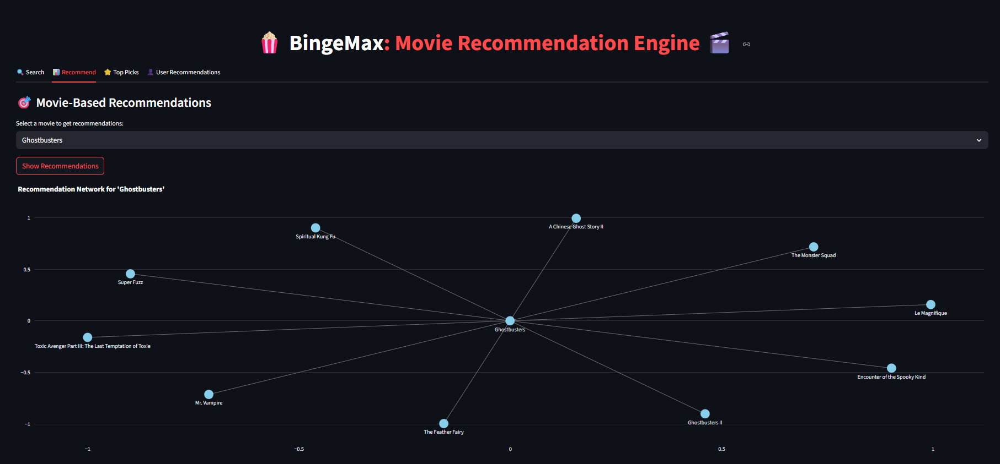
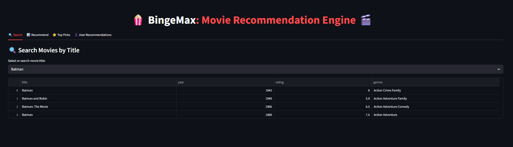
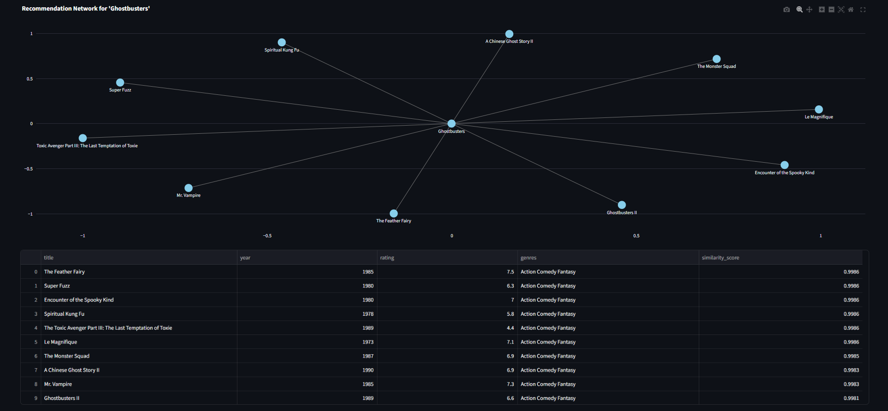
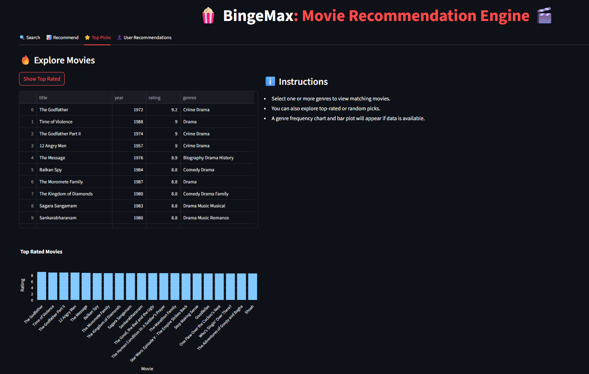
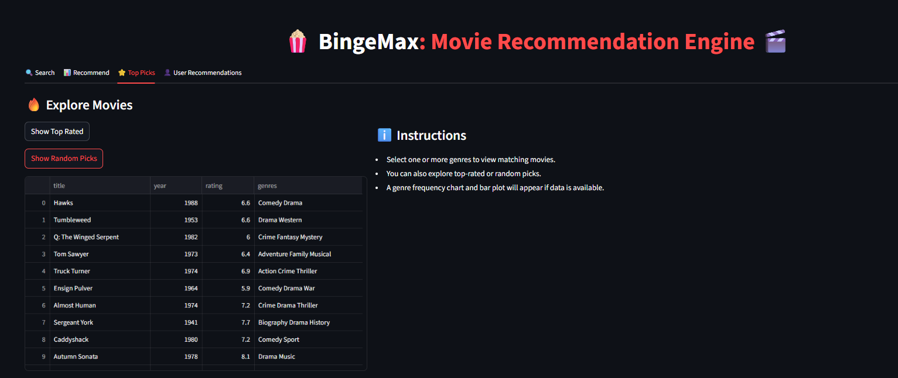
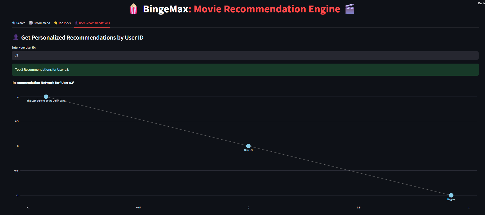

# 🎬 BingeMax: Personalized Movie Recommendation Engine

> **An AI-powered full-stack movie recommendation system that blends content-based filtering, collaborative filtering, and hybrid techniques. Built with FastAPI, Apache Airflow, MLflow, Streamlit, and Docker.**

<p align="center">
  
</p>

[](https://www.youtube.com/watch?v=Ams4sEn5)

---

## 📌 Overview

**BingeMax** is a cutting-edge, production-grade movie recommendation engine that delivers highly personalized movie suggestions using a hybrid blend of:

- 🎯 **Content-Based Filtering** (TF-IDF + cosine similarity)
- 🤝 **Collaborative Filtering** (ALS algorithm on implicit feedback)
- 🧠 **Hybrid Recommendation Model** combining both methods

Ideal for:

- Machine Learning Engineers building recommender systems
- Data Scientists practicing MLOps and full-stack deployment
- Developers looking for real-world end-to-end AI/ML pipelines

---

## 🧠 Recommendation Engine Workflow

### 🔹 Content-Based Filtering
- Converts movie metadata (title, genres, description) into **TF-IDF vectors**
- Uses **cosine similarity** to find and recommend similar movies

> $$ \text{similarity}(A, B) = \frac{A \cdot B}{\|A\| \cdot \|B\|} $$

### 🔹 Collaborative Filtering
- Uses **Alternating Least Squares (ALS)** from the `implicit` library
- Learns user-item latent factors to recommend movies based on past interactions

### 🔹 Hybrid Recommendation Model
- Combines both models using a tunable parameter `alpha ∈ [0, 1]`
- Produces recommendations ranked by a weighted scoring system

---

## ⚙️ Getting Started

### 📦 Prerequisites
- Docker + Docker Compose
- Python 3.10+ (for development environments)

### 🐳 Run with Docker Compose

```bash
docker compose down -v --remove-orphans  # Optional cleanup
docker compose up --build
```

### 🔗 Access the Interfaces

| Service        | URL                                                        |
| -------------- | ---------------------------------------------------------- |
| Streamlit App  | [http://localhost:8501](http://localhost:8501)             |
| FastAPI Docs   | [http://localhost:8000/docs](http://localhost:8000/docs)   |
| MLflow UI      | [http://localhost:5000](http://localhost:5000)             |
| Airflow UI     | [http://localhost:8080](http://localhost:8080) (user: airflow / pw: airflow) |

---
## 📂 Data Source

- This project uses publicly available, non-commercial movie data from [IMDb Datasets](https://datasets.imdbws.com/).
- The dataset includes metadata such as titles, genres, user ratings, and more.

## 📁 Project Structure

```
BingeMax/
├── src/
│   ├── api/               # FastAPI backend
│   ├── models/            # ALS, TF-IDF, hybrid logic
│   ├── data/              # Matrix builders and loaders
│   ├── evaluation/        # Model evaluation scripts
│   └── utils/             # Helper functions and config
├── streamlit_app/         # Streamlit-based UI frontend
├── airflow/               # Apache Airflow DAGs and configs
├── mlruns/                # MLflow experiment tracking
├── data/                  # Raw and processed datasets
├── docker-compose.yml
├── requirements.txt
└── README.md
```

---

## 🚀 REST API Endpoints (FastAPI)

| Method | Endpoint          | Purpose                               |
|--------|-------------------|----------------------------------------|
| GET    | `/titles`         | Fetch all movie titles                 |
| GET    | `/recommend`      | Recommend movies based on title        |
| GET    | `/recommend_user` | Personalized recommendations by user ID|
| GET    | `/top_rated`      | Fetch top-rated movies                 |
| GET    | `/random`         | Get random movie suggestions           |
| GET    | `/genre/{genre}`  | Get movies filtered by genre           |
| GET    | `/model/versions` | List registered ALS models             |
| POST   | `/model/promote`  | Promote selected model version         |

---

## 💡 Streamlit UI Features

### 🔍 Smart Search
<p align="center">
  
</p>

### 📊 Recommendations by Title
<p align="center">
  
</p>

### ⭐ Top Picks and Genre Filters
<p align="center">
  
  <br>
  
</p>

### 👤 Personalized Recommendations (ALS)
<p align="center">
  
</p>

---

## 🛰️ Airflow: Model Retraining Workflow

- DAG: `retrain_model_dag.py`
- Loads user-item interaction matrix
- Trains ALS model
- Logs experiments to MLflow
- Promotes the best model to production

```bash
airflow dags trigger retrain_als_model
```

---

## 📈 MLflow Experiment Tracking

- Experiment: `Movie-Recommender-ALS`
- Logs hyperparameters: `factors`, `regParam`, `iterations`
- Tracks metric: `sample_score`
- Registered Model: `ALSRecommender`
- MLflow UI: [http://localhost:5000](http://localhost:5000)

---

## 📊 Model Evaluation Metrics

| Metric       | Purpose                                   |
|--------------|-------------------------------------------|
| Sample Score | Proxy for ALS quality                     |
| RMSE         | Collaborative filtering regression error  |
| Precision@K  | Top-K recommendation accuracy             |
| Recall@K     | Top-K recall on known positives           |

---

## 🛠️ Tech Stack

| Component    | Tools & Libraries                         |
|--------------|-------------------------------------------|
| Backend API  | FastAPI                                   |
| Frontend     | Streamlit                                 |
| ML Models    | Scikit-Learn, Implicit ALS                |
| Scheduling   | Apache Airflow                            |
| Tracking     | MLflow                                    |
| Containerization | Docker, Docker Compose               |
| Visualization| Plotly, NetworkX                          |

---

## 🤝 How to Contribute

We welcome your ideas and contributions!

1. Fork the repository
2. Create a feature branch: `git checkout -b feature/your-feature`
3. Commit with meaningful messages
4. Open a Pull Request with a clear description

---

## 📜 License

Licensed under the [MIT License](./LICENSE).

---

## 👨‍💻 Author

**Pavan Yellathakota**  
Data Scientist | Machine Learning practitioner

📧 pavan.yellathakota.ds@gmail.com  
🌐 [LinkedIn](https://www.linkedin.com/in/pavanyellathakota/) <!-- Replace with your actual profile -->

> _"Because picking your next great movie should be effortless."_

Made with ❤️ using **FastAPI + Streamlit + MLflow + Docker + Airflow**
